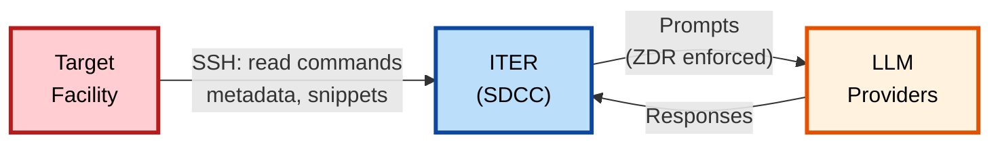
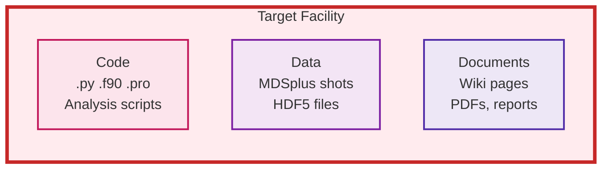
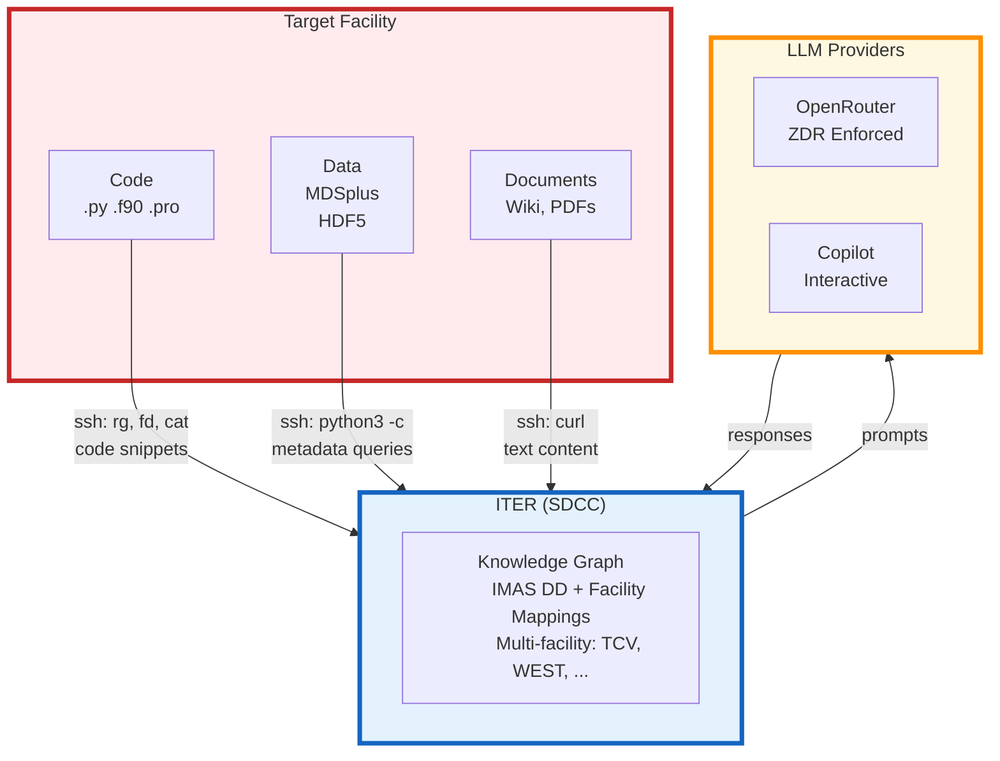
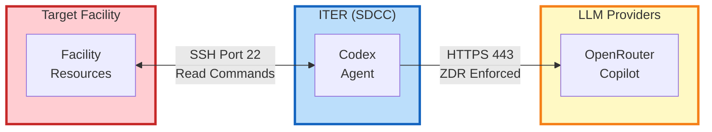
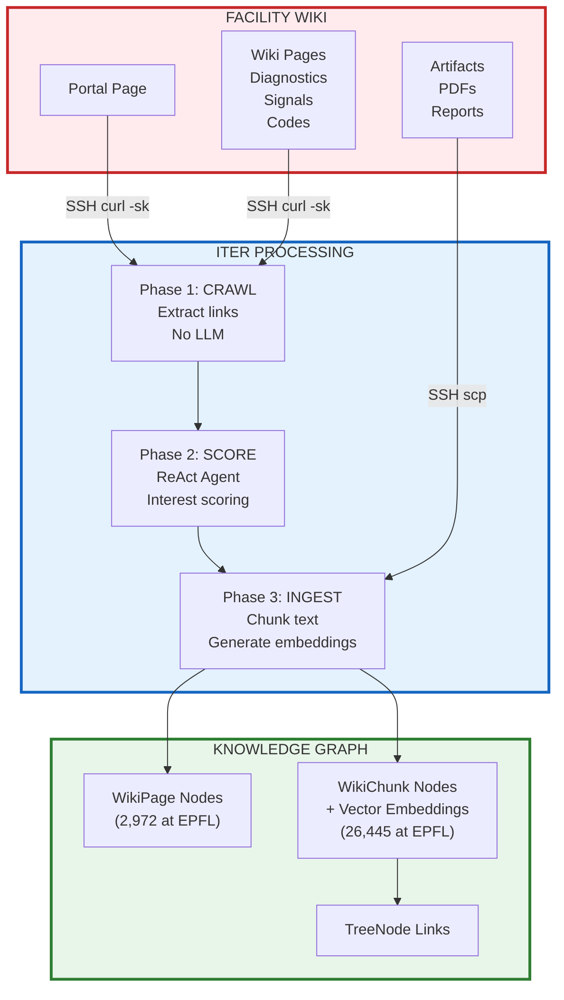
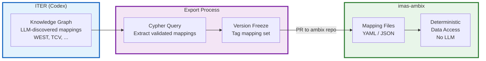

# IMAS Codex Architecture: Facility Access Justification

> **Document Purpose**: Technical architecture overview for facility system administrators  
> **Author**: Simon McIntosh, ITER Organization  
> **Date**: January 2026  
> **Proven at**: EPFL Swiss Plasma Center (TCV Tokamak)

---

## Executive Summary

IMAS Codex is a knowledge graph builder that maps facility-specific data structures to the IMAS (Integrated Modelling & Analysis Suite) standard. This document explains the data flow architecture, security controls, and justifies SSH access for metadata discovery.

**Key Points**:
- All LLM queries originate from **ITER (SDCC)**, never from the target facility
- SSH access executes **read commands** — no modifications to facility systems
- **No routine bulk data downloads** — primarily metadata, paths, and code snippets
- Code analysis uses **Zero Data Retention (ZDR)** LLM endpoints
- Mappings are **frozen** in imas-ambix for deterministic runtime use (no LLM at runtime)

**Proven Track Record**: This approach has been successfully deployed at EPFL (TCV), where we have mapped 171,000+ TreeNodes, ingested 8,500+ code chunks, and indexed 2,900+ wiki pages — all via read-only SSH access.

---

## Architecture Diagram

### High-Level Data Flow



### Facility Data Sources



### Complete System Architecture



**Key clarifications:**
- **No routine bulk data downloads** — We query metadata and extract sample values for validation, not entire datasets
- **Knowledge Graph** — Contains IMAS Data Dictionary structure AND facility-specific mappings from multiple facilities
- **Mappings persisted** — The IMAS↔facility path mappings discovered by LLM analysis are written to the graph for reuse

### Network Boundaries



### Key Security Point

```
╔═══════════════════════════════════════════════════════════════════╗
║                                                                   ║
║   Facility ─────────►  ITER  ───────────►  LLM Providers         ║
║            SSH (read)        HTTPS (ZDR)                         ║
║                                                                   ║
║   ALL LLM TRAFFIC ORIGINATES FROM ITER                           ║
║   NO DIRECT CONNECTION FROM FACILITY TO LLM PROVIDERS            ║
║                                                                   ║
╚═══════════════════════════════════════════════════════════════════╝
```

---

## Proven Example: EPFL/TCV Access

This section documents the actual SSH commands and data volumes from our successful deployment at EPFL (TCV Tokamak). These serve as concrete examples of what we would do at any new facility.

### SSH Command Categories

| Category | Command Pattern | Data Returned | Size |
|----------|-----------------|---------------|------|
| **Code Discovery** | `rg -l`, `fd -e`, `ls` | File paths | Paths only |
| **Code Reading** | `cat`, `head -n` | Source code snippets | Varies (avg ~1,700 chars) |
| **MDSplus Metadata** | `python3 -c "import MDSplus..."` | Node info | Scalar values |
| **Wiki Fetch** | `curl -sk` | Page HTML | Text content |
| **Directory Stats** | `tokei`, `scc`, `dust` | LOC counts | Numbers only |

### Code Discovery Commands (Real EPFL Examples)

```bash
# Find Python files containing IMAS-related patterns
# Discovered 238 files in /home/codes
ssh epfl 'rg -l "write_ids|read_ids|imas\." /home/codes --max-depth 4 -g "*.py"'

# Find files with MDSplus imports
# Found files like /home/agostini/mdsplus_py_tests/mds_put_value.py
ssh epfl 'rg -l "import MDSplus" /home/agostini -g "*.py" | head -50'

# List Python files in TCV analysis directory
ssh epfl 'fd -e py /home/agostini/tcv/lib'
# Returns: TCVLIUQE.py, TCVLIUQEMAT.py, tcv_diag.py, tcv_mag.py

# Directory structure
ssh epfl 'ls -la /home/agostini/tcv/lib/eqtools'
```

### Code Reading Commands (Real EPFL Examples)

```bash
# Read equilibrium code (LIUQE wrapper)
# File: /home/agostini/tcv/lib/eqtools/TCVLIUQE.py
ssh epfl 'head -100 /home/agostini/tcv/lib/eqtools/TCVLIUQE.py'

# Read MDSplus interface code
# File: /home/agostini/tcv/lib/tcvpy-master/tcv/mds.py
ssh epfl 'head -200 /home/agostini/tcv/lib/tcvpy-master/tcv/mds.py'

# Search for function signatures
ssh epfl 'rg -C 3 "def get_" /home/agostini/tcv/lib/tcv_diag.py'
```

### MDSplus Metadata Queries (Real EPFL Examples)

These queries extract **scalar metadata**, not time series or profile data.
TCV has 29 MDSplus trees including: `magnetics`, `results`, `thomson`, `ecrh`, `diagz`, `tcv_shot`.

```bash
# Query node metadata from magnetics tree
# Real nodes: \MAGNETICS::IPLASMA, \MAGNETICS::BPOL_AVG, \MAGNETICS::IPHI
ssh epfl "python3 -c \"
import MDSplus
tree = MDSplus.Tree('magnetics', 80000)
node = tree.getNode(r'\\\\MAGNETICS::IPLASMA')
print('usage:', node.usage)
print('description:', node.description)
print('dtype:', node.dtype_str)
\""

# Query scalar physics quantities for COCOS validation
ssh epfl "python3 -c \"
import MDSplus
tree = MDSplus.Tree('magnetics', 80000)
print('ip:', tree.getNode(r'\\\\MAGNETICS::IPLASMA').data())
print('iphi:', tree.getNode(r'\\\\MAGNETICS::IPHI').data())
\""

# List child nodes of a structure (hardware calibration)
ssh epfl "python3 -c \"
import MDSplus
tree = MDSplus.Tree('magnetics', 80000)
node = tree.getNode(r'\\\\MAGNETICS::TOP.HARDWARE.CALIB')
for child in node.getChildren()[:10]:
    print(child.node_name)
\""
```

### Wiki Content Queries (Real EPFL Examples)

TCV wiki at `spcwiki.epfl.ch` - 2,972 pages indexed.

```bash
# Fetch wiki page (requires -k for SSL cert issues)
ssh epfl 'curl -sk "https://spcwiki.epfl.ch/wiki/Magnetic_probes"'

# Fetch boundary physics documentation
ssh epfl 'curl -sk "https://spcwiki.epfl.ch/wiki/Boundary_physics"'

# Extract MDSplus paths from wiki page
ssh epfl 'curl -sk "https://spcwiki.epfl.ch/wiki/Magnetic_cabling" | 
          grep -oP "\\\\[A-Z_]+::[A-Z0-9_:]+"'

# Get page title
ssh epfl 'curl -skL "https://spcwiki.epfl.ch/wiki/Onboarding" | 
          grep -oP "(?<=<title>)[^<]+"'
```

### Directory Analysis Commands (Real EPFL Examples)

```bash
# Lines of code by language
ssh epfl 'tokei /home/agostini/tcv'

# Disk usage tree (depth 2)
ssh epfl 'dust -d 2 /home/codes'

# Code complexity metrics
ssh epfl 'scc /home/agostini/tcv/lib --format json'

# Count Python files in analysis directories
ssh epfl 'fd -e py /home/agostini | wc -l'
# Result: 284 files discovered
```

---

## COCOS Calculation (Local to ITER)

TCV uses LIUQE equilibrium code which operates in COCOS 17.
These scalar values are retrieved via SSH, and COCOS validation runs locally.

```python
from imas_codex.cocos import validate_cocos_from_data

# These values came from EPFL/TCV via SSH query above
# LIUQE is known to use COCOS 17 (see imas_codex/cocos/calculator.py)
result = validate_cocos_from_data(
    declared_cocos=17,      # LIUQE uses COCOS 17
    psi_axis=0.5,           # From MDSplus: \RESULTS::PSI_AXIS
    psi_edge=-0.2,          # From MDSplus: \RESULTS::PSI_EDGE
    ip=-1e6,                # From MDSplus: \MAGNETICS::IPLASMA [A]
    b0=-1.4,                # TCV typical toroidal field [T]
    q=3.0,                  # Safety factor (optional, improves confidence)
)

if result.is_consistent:
    print(f"COCOS {result.declared_cocos} confirmed")
    print(f"Confidence: {result.confidence:.0%}")
else:
    print(f"COCOS mismatch!")
    print(f"Declared: {result.declared_cocos}")
    print(f"Calculated: {result.calculated_cocos}")
    for error in result.inconsistencies:
        print(f"  - {error}")
```

**Output example:**
```
COCOS 17 confirmed
Confidence: 70%
```

---

## Wiki Ingestion Pipeline

At EPFL, we've ingested **2,972 wiki pages** from `spcwiki.epfl.ch` into **26,445 WikiChunk** nodes.



### Extracted Entities from Wiki

| Entity Type | Pattern | Example (EPFL/TCV) |
|-------------|---------|---------|
| MDSplus Paths | `\\TREE::NODE:PATH` | `\MAGNETICS::IPLASMA` |
| IMAS Paths | `ids/path/field` | `equilibrium/time_slice/psi` |
| Units | Physics units | `eV`, `Tesla`, `m^-3` |
| COCOS Values | `COCOS N` | `COCOS 17` (LIUQE) |
| Sign Conventions | Direction patterns | `positive clockwise` |

---

## Operational Mapping: imas-ambix Integration

The mappings discovered by Codex are exported to **imas-ambix** for deterministic runtime data access. This separation ensures:

- **No LLM at runtime** — Operational data mapping uses frozen, validated rules
- **Version-controlled mappings** — Each ambix release contains specific mapping versions
- **Reproducible science** — Same mapping version = same data transformations

### Mapping Export Flow



### Separation of Concerns

| Phase | Tool | Uses LLM? | Output |
|-------|------|-----------|--------|
| **Discovery** | imas-codex | ✅ Yes | Candidate mappings in graph |
| **Validation** | Human review | ❌ No | Approved mappings |
| **Export** | Graph query | ❌ No | Frozen YAML files |
| **Runtime** | imas-ambix | ❌ No | Deterministic data access |

### Example Mapping Export (EPFL/TCV)

```cypher
-- Extract validated EPFL/TCV mappings for ambix export
MATCH (f:Facility {id: 'epfl'})-[:HAS_TREE]->(t:MDSplusTree)
MATCH (tn:TreeNode)-[:TREE_NAME]->(t)
MATCH (tn)-[:MAPS_TO]->(ip:IMASPath)
WHERE tn.mapping_status = 'validated'
RETURN tn.path AS mdsplus_path,
       ip.full_path AS imas_path,
       tn.cocos_index AS cocos,
       tn.units AS units
ORDER BY tn.path
```

**Key point**: Once mappings are exported to imas-ambix and released, they are **frozen**. The LLM is only used during the discovery phase at ITER, never during operational data access at facilities.

---

## Data Flow Detail

### Data Sources Summary

| Category | Source | Data Extracted | Use Case |
|----------|--------|----------------|----------|
| **Facility Code** | `.f90`, `.py`, `.pro` | Function signatures, imports | IMAS mapping |
| **User Code** | Analysis scripts | Data access patterns | Usage examples |
| **MDSplus** | Shot database | Metadata, physics quantities | COCOS validation |
| **HDF5/Text** | Processed data | Structure, variable names | Schema discovery |
| **Wiki** | MediaWiki pages | Signal descriptions, conventions | Documentation |
| **PDFs** | Technical reports | Text content | Physics context |
| **Papers** | Publications | References, equations | Validation |

### What Travels Where

| Step | Data | From | To | Retention |
|------|------|------|-----|-----------|
| 1 | SSH commands (read) | ITER | Facility | Session only |
| 2 | Command output (paths, snippets) | Facility | ITER | Local graph |
| 3 | Physics quantities (psi, Ip, B0) | Facility | ITER | Local graph |
| 4 | Wiki content (HTML text) | Facility | ITER | Local graph |
| 5 | Prompts + snippets | ITER | LLM Provider | **Zero (ZDR)** |
| 6 | Structured responses | LLM Provider | ITER | Local graph |
| 7 | Graph snapshots | ITER | GHCR | **Private** (authenticated) |

### Critical Security Point

```
┌─────────────────────────────────────────────────────────────────┐
│  ALL LLM QUERIES ORIGINATE FROM ITER, NEVER FROM FACILITY      │
│                                                                 │
│  Facility ──SSH──► ITER ──HTTPS──► OpenRouter / Copilot        │
│            (read)       (prompts)                               │
│                                                                 │
│  No network traffic from Facility to LLM providers              │
└─────────────────────────────────────────────────────────────────┘
```

---

## Data Classification

### What Leaves the Facility (via SSH to ITER)

| Data Type | Source | Leaves? | Example (EPFL) | Purpose |
|-----------|--------|---------|----------------|---------|
| File paths | Filesystem | Yes | `/home/agostini/tcv/lib/tcv_diag.py` | Code discovery |
| Code snippets | Source files | Yes | Function signatures (~1,700 chars avg) | IMAS mapping |
| Signal names | MDSplus | Yes | `\MAGNETICS::IPLASMA` | Metadata |
| Physics quantities | MDSplus | Yes | `psi_axis=0.5`, `ip=-1e6` | COCOS validation |
| Wiki text | MediaWiki | Yes | Signal descriptions | Documentation |
| PDF text | Reports | Yes | Technical content | Context |
| Units & descriptions | Various | Yes | `A`, `plasma current` | Semantics |

### What Stays at the Facility

| Data Type | Source | Leaves? | Notes |
|-----------|--------|---------|-------|
| Raw shot data | MDSplus | **Never (routine)** | Time series, profiles not accessed |
| Waveform arrays | MDSplus/HDF5 | **Never (routine)** | Only scalar quantities queried |
| Complete source files | Filesystem | **Never** | Only snippets extracted |
| Compiled binaries | Filesystem | **Never** | Not relevant |
| User credentials | System | **Never** | SSH keys on ITER side |
| Internal hostnames | System | **Never** | In gitignored config |

### What Stays at ITER (Not Version Controlled)

| Data Type | Location | Version Controlled? |
|-----------|----------|---------------------|
| Infrastructure YAML | `config/facilities/<facility>_infrastructure.yaml` | ❌ No (gitignored) |
| Hostnames / IPs | Infrastructure YAML | ❌ No |
| API keys | `.env` | ❌ No |
| Neo4j database | `~/.local/share/imas-codex/neo4j/` | ❌ No |

### Graph Snapshots (Private GHCR)

| Data Type | Location | Access |
|-----------|----------|--------|
| Graph dump (`.dump`) | `ghcr.io/iterorganization/imas-codex-graph` | **Authenticated only** |
| Schema version | OCI annotations | **Authenticated only** |

**Important**: The graph is stored on GHCR for version control but is **not public**. Access requires GHCR authentication tokens. The graph contains:
- Signal names and descriptions (from wiki/code)
- IMAS path mappings
- Vector embeddings (dimensionality-reduced, not reversible to source)
- **No complete source code** — snippets ≤600 chars for context

---

## LLM Providers and Security

### Provider Configuration

Codex uses two LLM providers:

| Provider | Use Case | Interface | ZDR |
|----------|----------|-----------|-----|
| **OpenRouter** | CLI commands, batch enrichment | API | ✅ Enforced |
| **Microsoft Copilot** | Interactive development (VS Code) | Chat | ✅ Enterprise |

### Zero Data Retention (ZDR) Enforcement

CLI/batch jobs use OpenRouter with ZDR enforced:

```python
# Enforced in imas_codex/agents/llm.py
provider = {
    "zdr": True,                    # Zero Data Retention
    "data_collection": "deny",      # No training on prompts
}
```

**What ZDR means**:
- Prompts and responses are **not logged** by the provider
- Data is **not used for model training**
- Processing is **transient** — data discarded after response

### OpenRouter Privacy Settings

Account-level settings at [openrouter.ai/settings/privacy](https://openrouter.ai/settings/privacy):
- ✅ Disable providers that store inputs for training
- ✅ Enforce ZDR for all requests
- ✅ EU data residency (enterprise option)

---

## SSH Access Controls

### Command Whitelist

The Codex agent enforces a strict command whitelist:

```python
# Safe operations only
SAFE_COMMANDS = [
    # Reading
    "cat", "head", "tail", "less", "grep", "rg",
    # Listing
    "ls", "find", "fd", "tree", "du", "df",
    # System info
    "uname", "hostname", "whoami", "which",
    # Package queries
    "pip list", "python --version",
    # MDSplus queries (read-only)
    "python -c 'import MDSplus; ...'"
]

# BLOCKED - Never executed
BLOCKED_COMMANDS = [
    "rm", "mv", "cp", "chmod", "chown",    # File modification
    "sudo", "su", "doas",                   # Privilege escalation
    "kill", "pkill", "shutdown", "reboot",  # System control
    "curl", "wget", "nc", "ssh",            # Network operations
    "pip install", "conda install",         # Package installation
]
```

### SSH Configuration

Recommended SSH setup for ControlMaster (connection reuse):

```bash
# ~/.ssh/config on ITER operator machine
# Example: EPFL configuration
Host epfl
    HostName <epfl-gateway>
    User <username>
    ControlMaster auto
    ControlPath ~/.ssh/sockets/%r@%h-%p
    ControlPersist 600
    
    # Security hardening
    ForwardAgent no
    ForwardX11 no
```

---

## Security Recommendations

### For Facility System Administrators

| Recommendation | Rationale | Implementation |
|----------------|-----------|----------------|
| **Dedicated service account** | Audit trail, revocable access | Create `codex-reader` user with minimal permissions |
| **Read-only shell** | Prevent accidental modification | Use `rbash` or custom restricted shell |
| **Command logging** | Audit all executed commands | Enable `auditd` for SSH sessions |
| **Rate limiting** | Prevent excessive queries | Limit SSH connections per minute |
| **IP allowlist** | Restrict to ITER source IPs | Configure firewall rules |
| **Time-limited access** | Review periodically | Set account expiry, renew on request |

### For ITER Operators

| Recommendation | Rationale | Implementation |
|----------------|-----------|----------------|
| **Enable command audit log** | Local transparency | Log all SSH commands to file |
| **Rotate API keys monthly** | Limit exposure window | Scheduled key rotation |
| **Use path blocklist** | Exclude sensitive directories | Configure in facility YAML |
| **Limit snippet size** | Reduce code exposure | Configure `max_chunk_chars: 10000` |
| **Enforce ZDR at account level** | Belt and suspenders | OpenRouter privacy settings |

### Implementation: Command Audit Logging

```python
# Add to SSH wrapper for full transparency
import logging
from datetime import datetime

audit_logger = logging.getLogger("codex.audit")
audit_handler = logging.FileHandler("~/.codex_audit.log")
audit_logger.addHandler(audit_handler)

def ssh_command_with_audit(command: str, facility: str) -> str:
    """Execute SSH command with audit logging."""
    audit_logger.info(f"{datetime.now().isoformat()} | {facility} | {command}")
    return subprocess.run(["ssh", facility, command], ...)
```

### Implementation: Path Blocklist

```yaml
# config/facilities/<facility>.yaml
security:
  blocklist:
    paths:
      - /home/*/private
      - /restricted/*
      - /etc/shadow
      - /etc/passwd
    patterns:
      - "*password*"
      - "*secret*"
      - "*credential*"
    
  max_chunk_chars: 10000
  max_file_size_kb: 100
```

---

## Proposed Access Model

```
┌────────────────────────────────────────────────────────────────────┐
│                    PROPOSED ACCESS ARCHITECTURE                     │
├────────────────────────────────────────────────────────────────────┤
│                                                                    │
│  ITER                                Target Facility               │
│  ────                                ───────────────               │
│                                                                    │
│  ┌──────────────┐                   ┌──────────────┐               │
│  │ Operator     │                   │ codex-reader │               │
│  │ Workstation  │◄── SSH (22) ─────►│ (restricted) │               │
│  │              │    read commands  │              │               │
│  └──────┬───────┘                   └──────────────┘               │
│         │                                                          │
│         │ HTTPS (443)                                              │
│         ▼                                                          │
│  ┌──────────────┐                                                  │
│  │ OpenRouter   │◄─── ZDR Enforced (CLI/batch)                     │
│  │ Copilot      │◄─── Enterprise (interactive)                     │
│  └──────────────┘                                                  │
│                                                                    │
│  ⚠️ NO direct network path from Facility to LLM providers          │
│                                                                    │
└────────────────────────────────────────────────────────────────────┘
```

---

## Summary Table for Facility Approval

| Aspect | Status | Evidence |
|--------|--------|----------|
| **Access Type** | Read SSH commands | `rg`, `fd`, `cat`, `head`, `python3 -c` |
| **Data Extracted** | Metadata + code chunks | Avg ~1,700 chars per chunk |
| **Raw Data** | Never routine extraction | No time series, profiles, or waveforms |
| **LLM Origin** | ITER only | No Facility→LLM traffic |
| **LLM Retention** | Zero | ZDR enforced (OpenRouter) |
| **LLM Providers** | OpenRouter + Copilot | CLI batch / interactive |
| **Graph Storage** | Private GHCR | Authenticated access only |
| **Audit Trail** | Available | Can enable `auditd` logging |
| **Revocable** | Yes | Standard account management |
| **Proven Track Record** | Yes | EPFL/TCV successfully deployed |

---

## Contact

For questions about this architecture or to request access:

- **Technical Contact**: Simon McIntosh, ITER Organization
- **Project Repository**: [github.com/iterorganization/imas-codex](https://github.com/iterorganization/imas-codex)
- **Documentation**: [imas-codex docs](https://iterorganization.github.io/imas-codex/)
