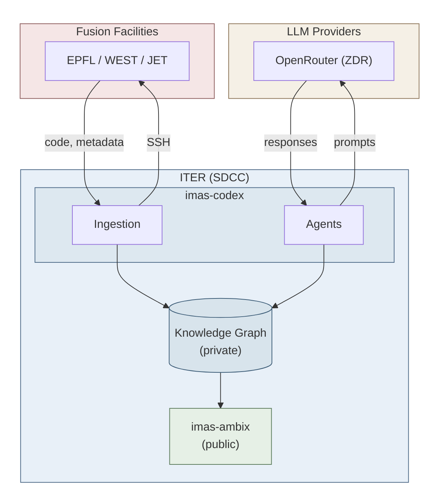
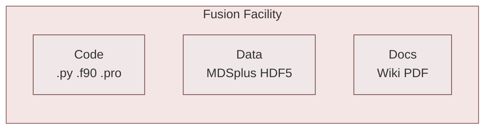
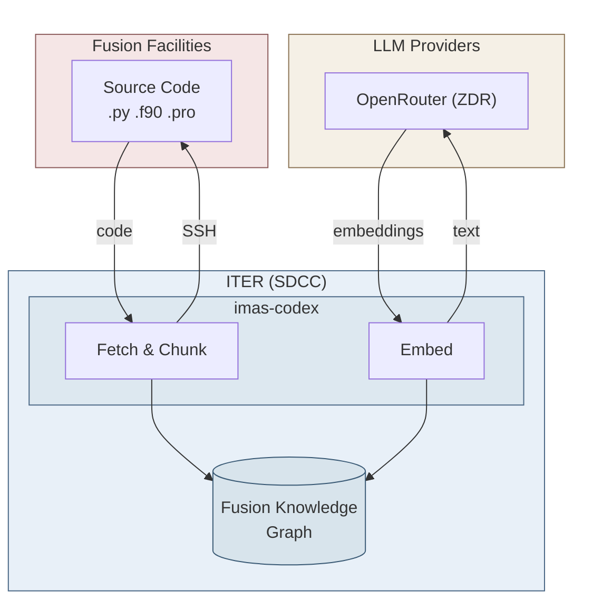
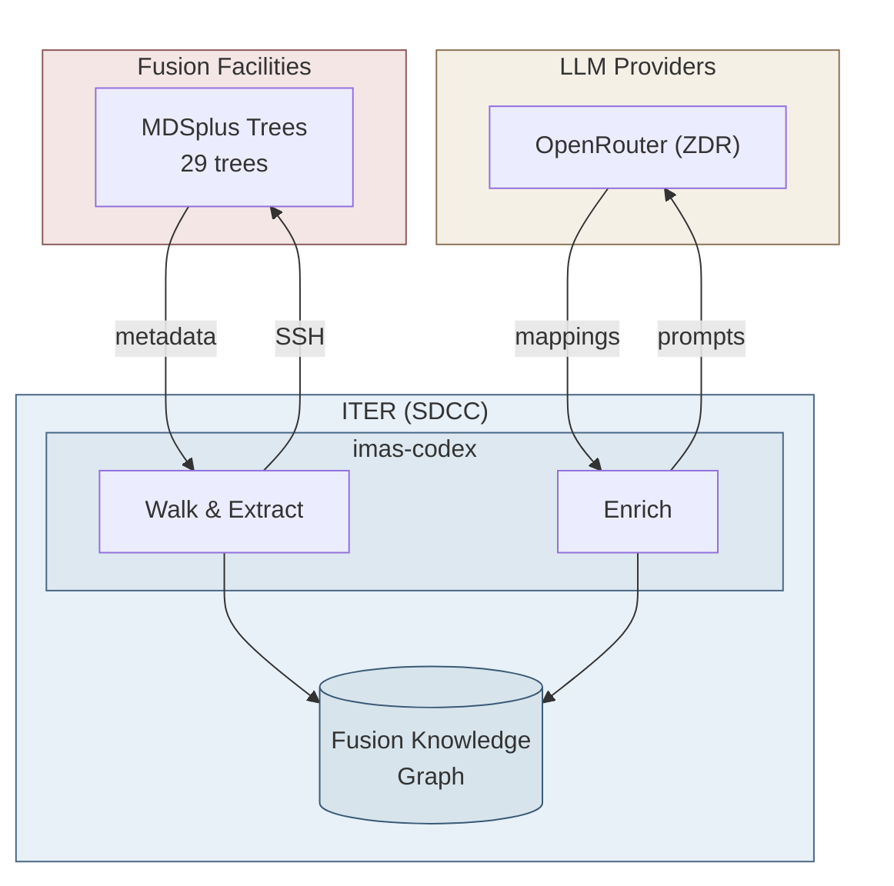
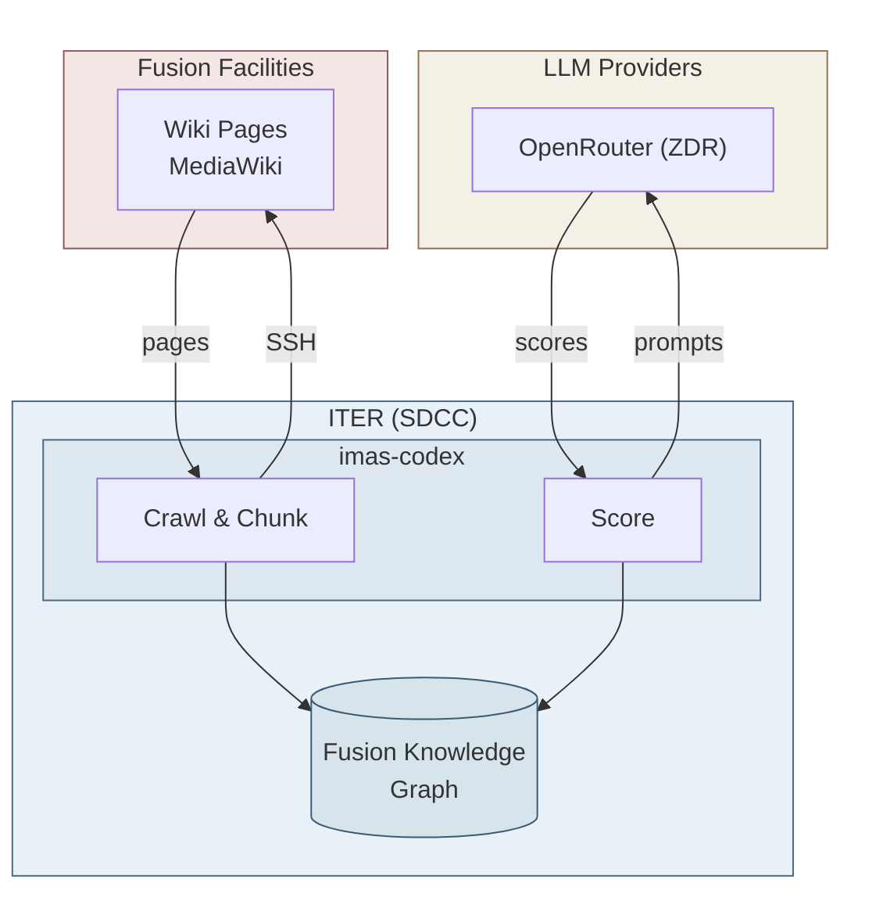

# IMAS Codex Architecture: Facility Access

> **Document Purpose**: Technical architecture overview for facility system administrators  
> **Author**: Simon McIntosh, ITER Organization  
> **Date**: January 2026  
> **Example Deployment**: EPFL Swiss Plasma Center (TCV Tokamak)

---

## Executive Summary

IMAS Codex is a knowledge graph builder that maps facility-specific data structures to the IMAS (Integrated Modelling & Analysis Suite) standard. This document explains the data flow architecture and SSH access patterns used for facility discovery.

IMAS Ambix is a partner project that consumes distilled mappings from the Codex knowledge graph. It is a deterministic runtime product with no LLM usage; end users employ Ambix to transform facility data to IMAS format or to generate UDA mapping files, all derived from validated mapping links exported from the Codex graph.

**Key Points**:
- All LLM queries originate from **ITER (SDCC)**, never from fusion facilities
- SSH access is used for **facility discovery** — exploring code, data structures, and documentation
- Code analysis uses **Zero Data Retention (ZDR)** LLM endpoints
- Mappings are **frozen** in imas-ambix for deterministic runtime use (no LLM at runtime)

**Track Record**: This approach has been deployed at EPFL (TCV), where we have mapped 171,000+ TreeNodes, ingested 8,500+ code chunks, and indexed 2,900+ wiki pages.

---

## System Architecture



**Components:**
- **imas-codex** — Graph builder that connects to facilities via SSH and uses LLMs for semantic analysis
- **Knowledge Graph** — Neo4j database storing IMAS Data Dictionary, facility mappings, and code examples  
- **imas-ambix** — Runtime library that reads frozen mappings from the graph to enable data transformation (no LLM, no SSH)

**Build-time vs Runtime:**
- **imas-codex (build-time)** — Connects to facilities via SSH, uses LLMs for semantic analysis, builds the knowledge graph
- **imas-ambix (runtime)** — Reads frozen mappings from graph, performs data transformation; no SSH or LLM access needed

**Key clarifications:**
- **Infrequent bulk data transfers** — We query metadata and extract sample values for validation; facility-side processing is preferred (e.g., extract Ip at a time point on facility, send scalar rather than entire waveform)
- **Knowledge Graph** — Contains IMAS Data Dictionary structure AND facility-specific mappings from multiple facilities
- **Mappings persisted** — The IMAS↔facility path mappings discovered by LLM analysis are written to the graph for reuse

---

## Facility-Side Tools (Optional)

For performance optimization, a small set of fast search tools may be installed into the user's home directory (`~/bin`). These are statically-compiled binaries with no external dependencies.

| Tool | Purpose | Size |
|------|---------|------|
| `rg` (ripgrep) | Fast content search | ~5 MB |
| `fd` | Fast file finding | ~3 MB |
| `tokei` | Lines of code counting | ~3 MB |
| `scc` | Code complexity metrics | ~3 MB |
| `dust` | Disk usage visualization | ~2 MB |

These tools are optional performance optimizations — standard shell commands (`grep`, `find`) work but are slower on large codebases. The imas-codex project itself runs entirely on ITER infrastructure.

---

## Ingestion Pipelines

Three parallel pipelines extract knowledge from facility data sources. Each pipeline follows a consistent pattern: discovery via SSH, optional LLM scoring, and ingestion into the knowledge graph.

### Facility Data Sources



### Code Chunking Pipeline

At EPFL, we've ingested **8,500+ code chunks** from analysis scripts and library code.



**Pipeline stages:**
1. **Fetch & Chunk** — Find files via `rg -l` and `fd -e`, extract function signatures (~1,700 chars avg)
2. **Embed** — Generate vector embeddings for semantic search

**Extracted entities:**
| Entity Type | Pattern | Example (EPFL/TCV) |
|-------------|---------|---------|
| Function signatures | `def func(args)` | `def get_equilibrium(shot, time)` |
| MDSplus imports | `import MDSplus` | Library dependencies |
| IMAS calls | `write_ids`, `read_ids` | IDS data access patterns |
| TDI expressions | `TDI("...")` | `TDI("\\RESULTS::IP")` |

### MDSplus Tree Walking Pipeline

At EPFL, we've mapped **171,000+ TreeNodes** from 29 MDSplus trees.



**Pipeline stages:**
1. **Walk & Extract** — Traverse tree structure, capture node metadata (path, dtype, units)
2. **Enrich** — LLM-assisted IMAS path mapping and COCOS identification

**Extracted entities:**
| Entity Type | Pattern | Example (EPFL/TCV) |
|-------------|---------|---------|
| Node paths | `\TREE::PATH` | `\MAGNETICS::IPLASMA` |
| Data types | `dtype_str` | `FLOAT`, `SIGNAL` |
| Units | Node metadata | `A`, `T`, `m^-3` |
| Descriptions | Node metadata | `Plasma current` |

### Wiki Ingestion Pipeline

At EPFL, we've ingested **2,972 wiki pages** from `spcwiki.epfl.ch` into **26,445 WikiChunk** nodes.



**Pipeline stages:**
1. **Crawl & Chunk** — Follow links from portal via `curl -sk`, extract text chunks
2. **Score** — LLM-assisted relevance scoring (ReAct agent)

**Extracted entities:**
| Entity Type | Pattern | Example (EPFL/TCV) |
|-------------|---------|---------|
| MDSplus Paths | `\\TREE::NODE:PATH` | `\MAGNETICS::IPLASMA` |
| IMAS Paths | `ids/path/field` | `equilibrium/time_slice/psi` |
| Units | Physics units | `eV`, `Tesla`, `m^-3` |
| COCOS Values | `COCOS N` | `COCOS 17` (LIUQE) |
| Sign Conventions | Direction patterns | `positive clockwise` |

---

## Example: EPFL/TCV Deployment

This section documents the actual SSH commands and data volumes from our deployment at EPFL (TCV Tokamak). These serve as concrete examples of what we do at fusion facilities.

### SSH Command Categories

| Category | Command Pattern | Data Returned | Size |
|----------|-----------------|---------------|------|
| **Code Discovery** | `rg -l`, `fd -e`, `ls` | File paths | Paths only |
| **Code Reading** | `cat`, `head -n` | Source code chunks | Varies (avg ~1,700 chars) |
| **MDSplus Metadata** | `python3 -c "import MDSplus..."` | Node info | Scalar values |
| **Wiki Fetch** | `curl -sk` | Page HTML | Text content |
| **Directory Stats** | `tokei`, `scc`, `dust` | LOC counts | Numbers only |

### Code Discovery Commands (Real EPFL Examples)

```bash
# Find Python files containing IMAS-related patterns
# Discovered 238 files in /home/codes
ssh epfl 'rg -l "write_ids|read_ids|imas\." /home/codes --max-depth 4 -g "*.py"'

# Find files with MDSplus imports
# Found files like /home/agostini/mdsplus_py_tests/mds_put_value.py
ssh epfl 'rg -l "import MDSplus" /home/agostini -g "*.py" | head -50'

# List Python files in TCV analysis directory
ssh epfl 'fd -e py /home/agostini/tcv/lib'
# Returns: TCVLIUQE.py, TCVLIUQEMAT.py, tcv_diag.py, tcv_mag.py

# Directory structure
ssh epfl 'ls -la /home/agostini/tcv/lib/eqtools'
```

### Code Reading Commands (Real EPFL Examples)

```bash
# Read equilibrium code (LIUQE wrapper)
# File: /home/agostini/tcv/lib/eqtools/TCVLIUQE.py
ssh epfl 'head -100 /home/agostini/tcv/lib/eqtools/TCVLIUQE.py'

# Read MDSplus interface code
# File: /home/agostini/tcv/lib/tcvpy-master/tcv/mds.py
ssh epfl 'head -200 /home/agostini/tcv/lib/tcvpy-master/tcv/mds.py'

# Search for function signatures
ssh epfl 'rg -C 3 "def get_" /home/agostini/tcv/lib/tcv_diag.py'
```

### MDSplus Metadata Queries (Real EPFL Examples)

These queries extract **scalar metadata**, not time series or profile data.
TCV has 29 MDSplus trees including: `magnetics`, `results`, `thomson`, `ecrh`, `diagz`, `tcv_shot`.

```bash
# Query node metadata from magnetics tree
# Real nodes: \MAGNETICS::IPLASMA, \MAGNETICS::BPOL_AVG, \MAGNETICS::IPHI
ssh epfl "python3 -c \"
import MDSplus
tree = MDSplus.Tree('magnetics', 80000)
node = tree.getNode(r'\\\\MAGNETICS::IPLASMA')
print('usage:', node.usage)
print('description:', node.description)
print('dtype:', node.dtype_str)
\""

# Query scalar physics quantities for COCOS validation
ssh epfl "python3 -c \"
import MDSplus
tree = MDSplus.Tree('magnetics', 80000)
print('ip:', tree.getNode(r'\\\\MAGNETICS::IPLASMA').data())
print('iphi:', tree.getNode(r'\\\\MAGNETICS::IPHI').data())
\""

# List child nodes of a structure (hardware calibration)
ssh epfl "python3 -c \"
import MDSplus
tree = MDSplus.Tree('magnetics', 80000)
node = tree.getNode(r'\\\\MAGNETICS::TOP.HARDWARE.CALIB')
for child in node.getChildren()[:10]:
    print(child.node_name)
\""
```

### Wiki Content Queries (Real EPFL Examples)

TCV wiki at `spcwiki.epfl.ch` - 2,972 pages indexed.

```bash
# Fetch wiki page (requires -k for SSL cert issues)
ssh epfl 'curl -sk "https://spcwiki.epfl.ch/wiki/Magnetic_probes"'

# Fetch boundary physics documentation
ssh epfl 'curl -sk "https://spcwiki.epfl.ch/wiki/Boundary_physics"'

# Extract MDSplus paths from wiki page
ssh epfl 'curl -sk "https://spcwiki.epfl.ch/wiki/Magnetic_cabling" | 
          grep -oP "\\\\[A-Z_]+::[A-Z0-9_:]+"'

# Get page title
ssh epfl 'curl -skL "https://spcwiki.epfl.ch/wiki/Onboarding" | 
          grep -oP "(?<=<title>)[^<]+"'
```

### Directory Analysis Commands (Real EPFL Examples)

```bash
# Lines of code by language
ssh epfl 'tokei /home/agostini/tcv'

# Disk usage tree (depth 2)
ssh epfl 'dust -d 2 /home/codes'

# Code complexity metrics
ssh epfl 'scc /home/agostini/tcv/lib --format json'

# Count Python files in analysis directories
ssh epfl 'fd -e py /home/agostini | wc -l'
# Result: 284 files discovered
```

---

## COCOS Calculation (Local to ITER)

TCV uses LIUQE equilibrium code which operates in COCOS 17.
These scalar values are retrieved via SSH, and COCOS validation runs locally.

```python
from imas_codex.cocos import validate_cocos_from_data

# These values came from EPFL/TCV via SSH query above
# LIUQE is known to use COCOS 17 (see imas_codex/cocos/calculator.py)
result = validate_cocos_from_data(
    declared_cocos=17,      # LIUQE uses COCOS 17
    psi_axis=0.5,           # From MDSplus: \RESULTS::PSI_AXIS
    psi_edge=-0.2,          # From MDSplus: \RESULTS::PSI_EDGE
    ip=-1e6,                # From MDSplus: \MAGNETICS::IPLASMA [A]
    b0=-1.4,                # TCV typical toroidal field [T]
    q=3.0,                  # Safety factor (optional, improves confidence)
)

if result.is_consistent:
    print(f"COCOS {result.declared_cocos} confirmed")
    print(f"Confidence: {result.confidence:.0%}")
else:
    print(f"COCOS mismatch!")
    print(f"Declared: {result.declared_cocos}")
    print(f"Calculated: {result.calculated_cocos}")
    for error in result.inconsistencies:
        print(f"  - {error}")
```

**Output example:**
```
COCOS 17 confirmed
Confidence: 70%
```

---

## Mapping Export: imas-ambix Integration

The mappings discovered by Codex are exported to **imas-ambix** for deterministic runtime data access. This separation ensures:

- **No LLM at runtime** — Operational data mapping uses frozen, validated rules
- **Version-controlled mappings** — Each ambix release contains specific mapping versions
- **Reproducible science** — Same mapping version = same data transformations

### Separation of Concerns

| Phase | Tool | Uses LLM? | Output |
|-------|------|-----------|--------|
| **Discovery** | imas-codex | ✅ Yes | Candidate mappings in graph |
| **Validation** | Human review | ❌ No | Approved mappings |
| **Export** | Graph query | ❌ No | Frozen YAML files |
| **Runtime** | imas-ambix | ❌ No | Deterministic data access |

### Example Mapping Export (EPFL/TCV)

```cypher
-- Extract validated EPFL/TCV mappings for ambix export
MATCH (f:Facility {id: 'epfl'})-[:HAS_TREE]->(t:MDSplusTree)
MATCH (tn:TreeNode)-[:TREE_NAME]->(t)
MATCH (tn)-[:MAPS_TO]->(ip:IMASPath)
WHERE tn.mapping_status = 'validated'
RETURN tn.path AS mdsplus_path,
       ip.full_path AS imas_path,
       tn.cocos_index AS cocos,
       tn.units AS units
ORDER BY tn.path
```

**Key point**: Once mappings are exported to imas-ambix and released, they are **frozen**. The LLM is only used during the discovery phase at ITER, never during operational data access at facilities.

---

## Data Flow Detail

### What Travels Where

| Step | Data | From | To | Retention |
|------|------|------|-----|-----------|
| 1 | SSH commands | ITER | Facility | Session only |
| 2 | Command output (paths, chunks) | Facility | ITER | Local graph |
| 3 | Physics quantities (psi, Ip, B0) | Facility | ITER | Local graph |
| 4 | Wiki content (HTML text) | Facility | ITER | Local graph |
| 5 | Prompts + chunks | ITER | LLM Provider | **Zero (ZDR)** |
| 6 | Structured responses | LLM Provider | ITER | Local graph |
| 7 | Graph snapshots | ITER | GHCR | **Private** (authenticated) |

### Data Classification

#### What Leaves the Facility (via SSH to ITER)

| Data Type | Source | Leaves? | Example (EPFL) | Purpose |
|-----------|--------|---------|----------------|---------|
| File paths | Filesystem | Yes | `/home/agostini/tcv/lib/tcv_diag.py` | Code discovery |
| Code chunks | Source files | Yes | Function signatures (~1,700 chars avg) | IMAS mapping |
| Signal names | MDSplus | Yes | `\MAGNETICS::IPLASMA` | Metadata |
| Physics quantities | MDSplus | Yes | `psi_axis=0.5`, `ip=-1e6` | COCOS validation |
| Wiki text | MediaWiki | Yes | Signal descriptions | Documentation |
| PDF text | Reports | Yes | Technical content | Context |
| Units & descriptions | Various | Yes | `A`, `plasma current` | Semantics |

#### What Stays at the Facility

| Data Type | Source | Leaves? | Notes |
|-----------|--------|---------|-------|
| Raw shot data | MDSplus | **Infrequent** | Time series, profiles: facility-side extraction preferred |
| Waveform arrays | MDSplus/HDF5 | **Infrequent** | Extract scalars on facility, send values not arrays |
| Complete source files | Filesystem | **No** | Only chunks extracted |
| Compiled binaries | Filesystem | **No** | Not relevant |
| User credentials | System | **No** | SSH keys on ITER side |
| Internal hostnames | System | **No** | In gitignored config |

#### What Stays at ITER (Not Version Controlled)

| Data Type | Location | Version Controlled? |
|-----------|----------|---------------------|
| Infrastructure YAML | `config/facilities/<facility>_infrastructure.yaml` | ❌ No (gitignored) |
| Hostnames / IPs | Infrastructure YAML | ❌ No |
| API keys | `.env` | ❌ No |
| Neo4j database | `~/.local/share/imas-codex/neo4j/` | ❌ No |

#### Graph Snapshots (Private GHCR)

| Data Type | Location | Access |
|-----------|----------|--------|
| Graph dump (`.dump`) | `ghcr.io/iterorganization/imas-codex-graph` | **Authenticated only** |
| Schema version | OCI annotations | **Authenticated only** |

**Important**: The graph is stored on GHCR for version control but is **not public**. Access requires GHCR authentication tokens.

The graph contains:
- Signal names and descriptions (from wiki/code)
- IMAS path mappings
- Vector embeddings with associated code chunks (avg ~1,700 chars)
- **No complete source files** — only relevant code chunks for context

---

## LLM Providers and Security

### Provider Configuration

Codex uses two LLM providers:

| Provider | Use Case | Interface | ZDR |
|----------|----------|-----------|-----|
| **OpenRouter** | CLI commands, batch enrichment | API | ✅ Enforced |
| **Microsoft Copilot** | Interactive development (VS Code) | Chat | ✅ Enterprise |

### Zero Data Retention (ZDR) Enforcement

CLI/batch jobs use OpenRouter with ZDR enforced:

```python
# Enforced in imas_codex/agents/llm.py
provider = {
    "zdr": True,                    # Zero Data Retention
    "data_collection": "deny",      # No training on prompts
}
```

**What ZDR means**:
- Prompts and responses are **not logged** by the provider
- Data is **not used for model training**
- Processing is **transient** — data discarded after response

---

## SSH Access

SSH commands are executed by the LLM agent, which is prompted to use only read operations. The agent uses standard shell commands for exploration:

```bash
# Typical commands used
rg -l "pattern" /path          # Search file contents
fd -e py /path                 # Find files by extension
cat /path/file.py              # Read file contents
head -n 100 /path/file.py      # Read file header
python3 -c "import MDSplus..." # Query MDSplus metadata
curl -sk "https://wiki/..."    # Fetch wiki pages
```

### SSH Configuration

Recommended SSH setup for ControlMaster (connection reuse):

```bash
# ~/.ssh/config on ITER operator machine
Host epfl
    HostName <epfl-gateway>
    User <username>
    ControlMaster auto
    ControlPath ~/.ssh/sockets/%r@%h-%p
    ControlPersist 600
```

---

## Optional: SSH Command Logging

Facilities may choose to enable SSH command logging for audit purposes:

```bash
# Example: Enable auditd for SSH sessions
# This is a facility-side configuration option
auditctl -a always,exit -F arch=b64 -S execve -F auid>=1000
```

---

## Summary Table for Facility Approval

| Aspect | Status | Evidence |
|--------|--------|----------|
| **Access Type** | Read SSH commands | `rg`, `fd`, `cat`, `head`, `python3 -c` |
| **Data Extracted** | Metadata + code chunks | Avg ~1,700 chars per chunk |
| **Raw Data** | Infrequent extraction | Facility-side processing preferred |
| **LLM Origin** | ITER only | No Facility→LLM traffic |
| **LLM Retention** | Zero | ZDR endpoints specified |
| **LLM Providers** | OpenRouter + Copilot | CLI batch / interactive |
| **Graph Storage** | Private GHCR | Authenticated access only |
| **Audit Trail** | Optional | Facility can enable `auditd` |
| **Revocable** | Yes | Standard account management |
| **Track Record** | Yes | EPFL/TCV deployed |

---

## Contact

For questions about this architecture or to request access:

- **Technical Contact**: Simon McIntosh, ITER Organization
- **Project Repository**: [github.com/iterorganization/imas-codex](https://github.com/iterorganization/imas-codex)
- **Documentation**: [imas-codex docs](https://iterorganization.github.io/imas-codex/)
