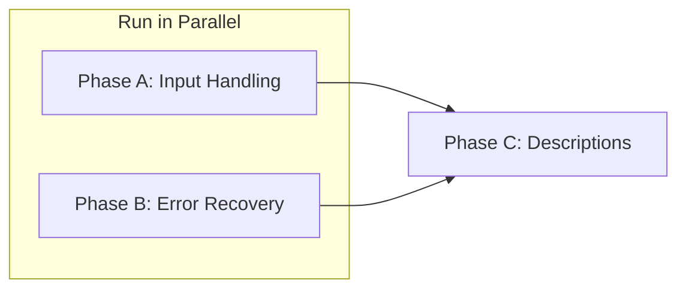

# IMAS MCP Tools Improvement Plan

## Overview

This plan addresses issues identified during LLM tool-use evaluation of the IMAS DDv4 MCP server.
Each phase targets up to ~2000 lines of edits and can run independently.

**Evaluation Date**: December 11, 2025  
**MCP Server Version**: 3.2.1.dev73  
**DD Version**: 4.1.0

---

## Executive Summary

| Phase | Focus Area | Priority | Est. Lines | Dependencies |
|-------|------------|----------|------------|--------------|
| A | Input Handling | Critical | ~800 | None |
| B | Error Recovery & Suggestions | High | ~700 | None |
| C | Tool Description Updates | High | ~200 | Phases A, B |

**Out of Scope**: `list_imas_docs` and `search_imas_docs` (external docs-mcp-server dependency)

---

## Phase A: Input Handling

### Objective
Fix all input parameter handling issues: validation, normalization, and empty query behavior.

### Issues Addressed
1. `ids_filter` only accepts JSON arrays, not space-delimited strings as documented
2. Empty query to `search_imas_paths` crashes with validation error
3. Validation errors lack context about what went wrong

### Files to Modify

#### 1. New utility module: `imas_mcp/tools/utils.py` (~100 lines)

```python
"""Shared utilities for MCP tool parameter handling."""

def normalize_ids_filter(ids_filter: str | list[str] | None) -> list[str] | None:
    """Normalize ids_filter to list format.
    
    Accepts:
        - None -> None
        - ["equilibrium", "magnetics"] -> ["equilibrium", "magnetics"]
        - "equilibrium magnetics" -> ["equilibrium", "magnetics"]
        - "equilibrium, magnetics" -> ["equilibrium", "magnetics"]
        - "equilibrium" -> ["equilibrium"]
    """
    if ids_filter is None:
        return None
    
    if isinstance(ids_filter, list):
        return [s.strip() for s in ids_filter if s and s.strip()]
    
    if isinstance(ids_filter, str):
        ids_filter = ids_filter.strip()
        if not ids_filter:
            return None
        
        # Handle space-delimited or comma-delimited
        for delim in [',', ' ']:
            if delim in ids_filter:
                return [s.strip() for s in ids_filter.split(delim) if s.strip()]
        
        return [ids_filter]
    
    return None


def normalize_paths_input(paths: str | list[str]) -> list[str]:
    """Normalize paths parameter to list format.
    
    Accepts:
        - "path1 path2" -> ["path1", "path2"]
        - ["path1", "path2"] -> ["path1", "path2"]
        - "path1" -> ["path1"]
    """
    if isinstance(paths, list):
        return [p.strip() for p in paths if p and p.strip()]
    
    if isinstance(paths, str):
        paths = paths.strip()
        if not paths:
            return []
        return [p.strip() for p in paths.split() if p.strip()]
    
    return []


def validate_query(query: str | None, tool_name: str) -> tuple[bool, str | None]:
    """Validate a search query, return (is_valid, error_message)."""
    if query is None or not query.strip():
        return False, (
            f"Query cannot be empty for {tool_name}. "
            "Provide a search term like 'electron temperature' or 'equilibrium/time_slice'. "
            "Use get_imas_overview() to explore available IDS structures."
        )
    return True, None
```

#### 2. Update `imas_mcp/tools/path_tools.py` (~250 lines changed)

Apply normalization and validation to all path tools:

```python
from imas_mcp.tools.utils import normalize_ids_filter, normalize_paths_input, validate_query

# In search_imas_paths:
async def search_imas_paths(
    query: str,
    ids_filter: str | list[str] | None = None,
    max_results: int = 50,
    search_mode: str = "auto",
    response_profile: str = "standard",
) -> SearchPathsResponse:
    # Validate query
    is_valid, error = validate_query(query, "search_imas_paths")
    if not is_valid:
        return SearchPathsResponse(
            hits=[],
            query=query or "",
            search_mode="none",
            error=error,
        )
    
    # Normalize ids_filter
    normalized_filter = normalize_ids_filter(ids_filter)
    
    # ... rest of implementation

# In check_imas_paths:
async def check_imas_paths(
    paths: str | list[str],
    ids: str | None = None,
) -> CheckPathsResponse:
    normalized_paths = normalize_paths_input(paths)
    
    if not normalized_paths:
        return CheckPathsResponse(
            results=[],
            summary=CheckSummary(total=0, found=0, not_found=0, invalid=0),
            error="No paths provided. Provide space-delimited paths like 'equilibrium/time_slice/boundary/psi'.",
        )
    
    # Apply IDS prefix if provided
    if ids:
        normalized_paths = [f"{ids}/{p}" if not p.startswith(ids) else p for p in normalized_paths]
    
    # ... rest of implementation

# In fetch_imas_paths:
async def fetch_imas_paths(
    paths: str | list[str],
    ids: str | None = None,
) -> FetchPathsResponse:
    normalized_paths = normalize_paths_input(paths)
    
    if not normalized_paths:
        return FetchPathsResponse(
            nodes=[],
            summary=FetchSummary(total_requested=0, retrieved=0),
            error="No paths provided.",
        )
    
    # ... rest of implementation

# In list_imas_paths:
async def list_imas_paths(
    paths: str,
    format: str = "yaml",
    leaf_only: bool = False,
    include_ids_prefix: bool = True,
    max_paths: int | None = None,
) -> ListPathsResponse:
    if not paths or not paths.strip():
        return ListPathsResponse(
            result=None,
            error="No IDS or path prefix provided. Example: paths='equilibrium' or paths='core_profiles/profiles_1d'.",
        )
    
    # ... rest of implementation
```

#### 3. Update `imas_mcp/tools/cluster_tools.py` (~80 lines changed)

```python
from imas_mcp.tools.utils import normalize_ids_filter, validate_query

async def search_imas_clusters(
    query: str,
    ids_filter: str | list[str] | None = None,
) -> ClusterSearchResponse:
    # Validate query
    is_valid, error = validate_query(query, "search_imas_clusters")
    if not is_valid:
        return ClusterSearchResponse(
            result=None,
            error=error,
        )
    
    # Normalize ids_filter
    normalized_filter = normalize_ids_filter(ids_filter)
    
    # ... rest of implementation
```

#### 4. Update `imas_mcp/tools/identifier_tools.py` (~50 lines changed)

```python
from imas_mcp.tools.utils import normalize_ids_filter

async def get_imas_identifiers(
    query: str | None = None,
) -> IdentifierResponse:
    # query is optional for this tool - None means return all
    # ... rest of implementation
```

#### 5. Update `imas_mcp/models/responses.py` (~100 lines changed)

Add error field to response models:

```python
class SearchPathsResponse(BaseModel):
    """Response from search_imas_paths."""
    hits: list[PathHit] = []
    query: str
    search_mode: str
    ids_filter: list[str] | None = None
    max_results: int | None = None
    error: str | None = None  # Add this

class CheckPathsResponse(BaseModel):
    """Response from check_imas_paths."""
    results: list[PathCheckResult]
    summary: CheckSummary
    error: str | None = None  # Add this

class FetchPathsResponse(BaseModel):
    """Response from fetch_imas_paths."""
    nodes: list[PathNode]
    summary: FetchSummary
    error: str | None = None  # Add this

class ListPathsResponse(BaseModel):
    """Response from list_imas_paths."""
    result: ListResult | None
    error: str | None = None  # Add this

class ClusterSearchResponse(BaseModel):
    """Response from search_imas_clusters."""
    result: ClusterResult | None
    error: str | None = None  # Add this
```

#### 6. New test file: `tests/tools/test_utils.py` (~150 lines)

```python
"""Tests for tool utility functions."""
import pytest
from imas_mcp.tools.utils import normalize_ids_filter, normalize_paths_input, validate_query


class TestNormalizeIdsFilter:
    def test_none_returns_none(self):
        assert normalize_ids_filter(None) is None
    
    def test_empty_string_returns_none(self):
        assert normalize_ids_filter("") is None
        assert normalize_ids_filter("   ") is None
    
    def test_list_passthrough(self):
        assert normalize_ids_filter(["equilibrium", "magnetics"]) == ["equilibrium", "magnetics"]
    
    def test_list_strips_whitespace(self):
        assert normalize_ids_filter(["  equilibrium ", " magnetics  "]) == ["equilibrium", "magnetics"]
    
    def test_list_filters_empty(self):
        assert normalize_ids_filter(["equilibrium", "", "magnetics"]) == ["equilibrium", "magnetics"]
    
    def test_space_delimited_string(self):
        assert normalize_ids_filter("equilibrium magnetics") == ["equilibrium", "magnetics"]
    
    def test_comma_delimited_string(self):
        assert normalize_ids_filter("equilibrium, magnetics") == ["equilibrium", "magnetics"]
    
    def test_single_string(self):
        assert normalize_ids_filter("equilibrium") == ["equilibrium"]
    
    def test_multiple_spaces(self):
        assert normalize_ids_filter("equilibrium   magnetics") == ["equilibrium", "magnetics"]


class TestNormalizePathsInput:
    def test_empty_returns_empty_list(self):
        assert normalize_paths_input("") == []
        assert normalize_paths_input("   ") == []
    
    def test_list_passthrough(self):
        result = normalize_paths_input(["path/one", "path/two"])
        assert result == ["path/one", "path/two"]
    
    def test_space_delimited(self):
        result = normalize_paths_input("path/one path/two")
        assert result == ["path/one", "path/two"]
    
    def test_single_path(self):
        assert normalize_paths_input("equilibrium/time_slice") == ["equilibrium/time_slice"]


class TestValidateQuery:
    def test_valid_query(self):
        is_valid, error = validate_query("electron temperature", "test_tool")
        assert is_valid is True
        assert error is None
    
    def test_empty_query(self):
        is_valid, error = validate_query("", "test_tool")
        assert is_valid is False
        assert "cannot be empty" in error
    
    def test_none_query(self):
        is_valid, error = validate_query(None, "test_tool")
        assert is_valid is False
        assert error is not None
    
    def test_whitespace_query(self):
        is_valid, error = validate_query("   ", "test_tool")
        assert is_valid is False
```

#### 7. Update existing tests (~70 lines changed)

Update `tests/tools/test_path_tool.py` to test new behavior:

```python
class TestSearchImasPathsEdgeCases:
    async def test_empty_query_returns_error(self, mcp_context):
        response = await search_imas_paths(query="")
        assert response.error is not None
        assert "cannot be empty" in response.error
        assert response.hits == []
    
    async def test_ids_filter_space_delimited(self, mcp_context):
        response = await search_imas_paths(
            query="temperature",
            ids_filter="equilibrium magnetics"
        )
        # Should work, not return empty
        assert response.error is None
    
    async def test_ids_filter_comma_delimited(self, mcp_context):
        response = await search_imas_paths(
            query="temperature",
            ids_filter="equilibrium, magnetics"
        )
        assert response.error is None
```

### Acceptance Criteria
- [ ] `ids_filter="equilibrium magnetics"` works identically to `ids_filter=["equilibrium", "magnetics"]`
- [ ] `ids_filter="equilibrium, magnetics"` also works
- [ ] Empty query returns helpful error message, not crash
- [ ] Empty paths input returns helpful error message
- [ ] All existing tests pass
- [ ] New utility tests pass

---

## Phase B: Error Recovery & Suggestions

### Objective
When paths are not found, provide explicit feedback and suggest corrections using fuzzy matching.

### Issues Addressed
1. `fetch_imas_paths` silently omits not-found paths (shows `retrieved: 1, not_found: 1` but doesn't say which)
2. No suggestions for typos like `"equilibrum"` instead of `"equilibrium"`
3. LLMs can't self-correct path names without feedback

### Files to Modify

#### 1. New module: `imas_mcp/search/fuzzy_matcher.py` (~200 lines)

```python
"""Fuzzy matching for IMAS path suggestions."""
from difflib import get_close_matches
from functools import lru_cache


class PathFuzzyMatcher:
    """Provides fuzzy matching suggestions for invalid paths."""
    
    def __init__(self, valid_ids_names: list[str], valid_paths: list[str]):
        self.valid_ids_names = valid_ids_names
        self.valid_paths = valid_paths
        self._path_by_ids: dict[str, list[str]] = {}
        self._build_path_index()
    
    def _build_path_index(self) -> None:
        """Build index of paths by IDS name for faster lookup."""
        for path in self.valid_paths:
            ids_name = path.split('/')[0] if '/' in path else path
            if ids_name not in self._path_by_ids:
                self._path_by_ids[ids_name] = []
            self._path_by_ids[ids_name].append(path)
    
    def suggest_ids(self, invalid_ids: str, max_suggestions: int = 3) -> list[str]:
        """Suggest valid IDS names for a typo."""
        if not invalid_ids:
            return []
        return get_close_matches(
            invalid_ids.lower(),
            [ids.lower() for ids in self.valid_ids_names],
            n=max_suggestions,
            cutoff=0.6
        )
    
    def suggest_paths(self, invalid_path: str, max_suggestions: int = 3) -> list[str]:
        """Suggest valid paths for a typo or partial path."""
        if not invalid_path:
            return []
        
        # Extract IDS name from path
        parts = invalid_path.split('/')
        ids_name = parts[0]
        
        # First check if IDS name is valid
        if ids_name not in self.valid_ids_names:
            # Suggest similar IDS names
            similar_ids = self.suggest_ids(ids_name, max_suggestions=1)
            if similar_ids:
                # Try to find paths with the corrected IDS
                corrected_ids = similar_ids[0]
                if corrected_ids in self._path_by_ids:
                    corrected_path = '/'.join([corrected_ids] + parts[1:])
                    candidates = self._path_by_ids[corrected_ids]
                    return get_close_matches(corrected_path, candidates, n=max_suggestions, cutoff=0.5)
            return []
        
        # IDS is valid, search within that IDS
        candidates = self._path_by_ids.get(ids_name, self.valid_paths)
        return get_close_matches(invalid_path, candidates, n=max_suggestions, cutoff=0.5)
    
    def get_suggestion_for_path(self, path: str) -> str | None:
        """Get a single best suggestion for a path, formatted as hint."""
        suggestions = self.suggest_paths(path, max_suggestions=1)
        if suggestions:
            return f"Did you mean: {suggestions[0]}?"
        
        # Try IDS-level suggestion
        ids_name = path.split('/')[0] if '/' in path else path
        ids_suggestions = self.suggest_ids(ids_name, max_suggestions=1)
        if ids_suggestions:
            return f"Unknown IDS '{ids_name}'. Did you mean: {ids_suggestions[0]}?"
        
        return None


# Singleton instance - initialized lazily
_matcher: PathFuzzyMatcher | None = None


def get_fuzzy_matcher(valid_ids_names: list[str], valid_paths: list[str]) -> PathFuzzyMatcher:
    """Get or create the fuzzy matcher singleton."""
    global _matcher
    if _matcher is None:
        _matcher = PathFuzzyMatcher(valid_ids_names, valid_paths)
    return _matcher


def suggest_correction(path: str, valid_ids_names: list[str], valid_paths: list[str]) -> str | None:
    """Convenience function to get a suggestion for a path."""
    matcher = get_fuzzy_matcher(valid_ids_names, valid_paths)
    return matcher.get_suggestion_for_path(path)
```

#### 2. Update `imas_mcp/models/responses.py` (~80 lines)

Add not-found path details:

```python
class NotFoundPath(BaseModel):
    """Details about a path that was not found."""
    path: str
    reason: str  # "invalid_ids", "path_not_exists", "deprecated"
    suggestion: str | None = None


class FetchSummary(BaseModel):
    """Summary of fetch operation."""
    total_requested: int
    retrieved: int
    deprecated: int = 0
    excluded: int = 0
    not_found: int = 0
    invalid: int = 0
    physics_domains: list[str] = []


class FetchPathsResponse(BaseModel):
    """Response from fetch_imas_paths."""
    nodes: list[PathNode]
    summary: FetchSummary
    not_found_paths: list[NotFoundPath] = []  # Add explicit list
    deprecated_paths: list[str] = []
    excluded_paths: list[str] = []
    error: str | None = None


class CheckPathResult(BaseModel):
    """Result for a single path check."""
    path: str
    exists: bool
    ids_name: str | None = None
    data_type: str | None = None
    units: str | None = None
    suggestion: str | None = None  # Add suggestion field
    error: str | None = None
```

#### 3. Update `imas_mcp/tools/path_tools.py` (~200 lines)

Integrate fuzzy matching into check and fetch:

```python
from imas_mcp.search.fuzzy_matcher import suggest_correction

async def check_imas_paths(
    paths: str | list[str],
    ids: str | None = None,
) -> CheckPathsResponse:
    normalized_paths = normalize_paths_input(paths)
    
    if not normalized_paths:
        return CheckPathsResponse(
            results=[],
            summary=CheckSummary(total=0, found=0, not_found=0, invalid=0),
            error="No paths provided.",
        )
    
    # Apply IDS prefix if provided
    if ids:
        normalized_paths = [f"{ids}/{p}" if not p.startswith(f"{ids}/") else p for p in normalized_paths]
    
    results = []
    found_count = 0
    not_found_count = 0
    
    # Get valid paths/IDS for suggestions
    valid_ids = get_all_ids_names()  # Implement this
    valid_paths = get_all_paths()     # Implement this
    
    for path in normalized_paths:
        result = lookup_path(path)  # Existing lookup
        
        if result.exists:
            found_count += 1
            results.append(CheckPathResult(
                path=path,
                exists=True,
                ids_name=result.ids_name,
                data_type=result.data_type,
                units=result.units,
            ))
        else:
            not_found_count += 1
            suggestion = suggest_correction(path, valid_ids, valid_paths)
            results.append(CheckPathResult(
                path=path,
                exists=False,
                suggestion=suggestion,
            ))
    
    return CheckPathsResponse(
        results=results,
        summary=CheckSummary(
            total=len(normalized_paths),
            found=found_count,
            not_found=not_found_count,
            invalid=0,
        ),
    )


async def fetch_imas_paths(
    paths: str | list[str],
    ids: str | None = None,
) -> FetchPathsResponse:
    normalized_paths = normalize_paths_input(paths)
    
    if not normalized_paths:
        return FetchPathsResponse(
            nodes=[],
            summary=FetchSummary(total_requested=0, retrieved=0),
            error="No paths provided.",
        )
    
    # Apply IDS prefix if provided
    if ids:
        normalized_paths = [f"{ids}/{p}" if not p.startswith(f"{ids}/") else p for p in normalized_paths]
    
    nodes = []
    not_found_paths = []
    
    # Get valid paths/IDS for suggestions
    valid_ids = get_all_ids_names()
    valid_paths = get_all_paths()
    
    for path in normalized_paths:
        result = fetch_path_details(path)  # Existing fetch
        
        if result is not None:
            nodes.append(result)
        else:
            suggestion = suggest_correction(path, valid_ids, valid_paths)
            not_found_paths.append(NotFoundPath(
                path=path,
                reason="path_not_exists",
                suggestion=suggestion,
            ))
    
    return FetchPathsResponse(
        nodes=nodes,
        summary=FetchSummary(
            total_requested=len(normalized_paths),
            retrieved=len(nodes),
            not_found=len(not_found_paths),
        ),
        not_found_paths=not_found_paths,
    )
```

#### 4. New test file: `tests/search/test_fuzzy_matcher.py` (~120 lines)

```python
"""Tests for fuzzy path matching."""
import pytest
from imas_mcp.search.fuzzy_matcher import PathFuzzyMatcher


@pytest.fixture
def matcher():
    valid_ids = ["equilibrium", "core_profiles", "magnetics", "summary"]
    valid_paths = [
        "equilibrium/time_slice",
        "equilibrium/time_slice/boundary",
        "equilibrium/time_slice/boundary/psi",
        "equilibrium/time_slice/global_quantities",
        "equilibrium/time_slice/global_quantities/ip",
        "core_profiles/profiles_1d",
        "core_profiles/profiles_1d/electrons",
        "core_profiles/profiles_1d/electrons/temperature",
        "magnetics/flux_loop",
        "magnetics/b_field_pol_probe",
    ]
    return PathFuzzyMatcher(valid_ids, valid_paths)


class TestSuggestIds:
    def test_typo_equilibrum(self, matcher):
        suggestions = matcher.suggest_ids("equilibrum")
        assert "equilibrium" in suggestions
    
    def test_typo_core_profile(self, matcher):
        suggestions = matcher.suggest_ids("core_profile")
        assert "core_profiles" in suggestions
    
    def test_completely_wrong(self, matcher):
        suggestions = matcher.suggest_ids("xxxxxxxx")
        assert suggestions == []


class TestSuggestPaths:
    def test_typo_in_ids(self, matcher):
        suggestions = matcher.suggest_paths("equilibrum/time_slice")
        # Should suggest the corrected path
        assert any("equilibrium/time_slice" in s for s in suggestions)
    
    def test_typo_in_path_segment(self, matcher):
        suggestions = matcher.suggest_paths("equilibrium/timeslice")
        assert "equilibrium/time_slice" in suggestions
    
    def test_partial_path(self, matcher):
        suggestions = matcher.suggest_paths("equilibrium/time_slice/bound")
        assert any("boundary" in s for s in suggestions)


class TestGetSuggestionForPath:
    def test_returns_formatted_hint(self, matcher):
        hint = matcher.get_suggestion_for_path("equilibrum/time_slice")
        assert hint is not None
        assert "Did you mean" in hint
    
    def test_returns_none_for_unrecognizable(self, matcher):
        hint = matcher.get_suggestion_for_path("xxxxxxxx/yyyyyyyy/zzzzzzzz")
        # May or may not have a suggestion depending on cutoff
        pass
```

#### 5. Update existing tests (~50 lines)

Add tests for not-found path reporting:

```python
class TestFetchImasPathsNotFound:
    async def test_not_found_paths_listed(self, mcp_context):
        response = await fetch_imas_paths(
            paths="equilibrium/time_slice/boundary/psi invalid/path/here"
        )
        assert response.summary.retrieved == 1
        assert response.summary.not_found == 1
        assert len(response.not_found_paths) == 1
        assert response.not_found_paths[0].path == "invalid/path/here"
    
    async def test_suggestion_for_typo(self, mcp_context):
        response = await fetch_imas_paths(paths="equilibrum/time_slice")
        assert len(response.not_found_paths) == 1
        assert response.not_found_paths[0].suggestion is not None
        assert "equilibrium" in response.not_found_paths[0].suggestion
```

### Acceptance Criteria
- [ ] Not-found paths are explicitly listed with path name
- [ ] Each not-found path includes reason
- [ ] Typos get "Did you mean: X?" suggestions
- [ ] IDS name typos get suggestions
- [ ] Suggestions are ranked by similarity
- [ ] All existing tests pass

---

## Phase C: Tool Description Updates

### Objective
Update MCP tool descriptions to accurately reflect the new parameter behavior.

### Dependencies
Phases A and B must be merged first.

### Files to Modify

#### 1. Update `imas_mcp/server.py` (~200 lines)

Update all tool descriptions:

```python
# search_imas_paths
"""Find IMAS IDS entries using semantic and lexical search.

Parameters:
- query (required): Natural language or path-like query. 
  Examples: 'electron temperature profile', 'equilibrium/time_slice'
- ids_filter: Limit search to specific IDS. Accepts:
  - JSON array: ["equilibrium", "magnetics"]
  - Space-delimited: "equilibrium magnetics"  
  - Comma-delimited: "equilibrium, magnetics"
  - Single IDS: "equilibrium"
- max_results: Maximum paths to return (default: 50)
- search_mode: 'auto' (default), 'semantic', 'lexical', or 'hybrid'
- response_profile: 'minimal', 'standard' (default), or 'detailed'

Returns ranked list of matching paths with documentation and metadata.
Returns error message with guidance if query is empty."""


# check_imas_paths  
"""Fast batch validation of IMAS paths.

Parameters:
- paths (required): Space-delimited paths or list.
  Example: 'equilibrium/time_slice/boundary/psi core_profiles/profiles_1d/electrons/temperature'
- ids: Optional IDS prefix applied to all paths.
  Example: ids='equilibrium', paths='time_slice/boundary/psi'

Returns existence status, data type, and units for each path.
Includes suggestions for paths that are not found (typo correction)."""


# fetch_imas_paths
"""Retrieve full IMAS path data with documentation.

Parameters:
- paths (required): Space-delimited paths or list.
- ids: Optional IDS prefix applied to all paths.

Returns detailed documentation, units, coordinates, and validation rules.
Explicitly lists any paths that were not found with suggestions."""


# list_imas_paths
"""List all data paths in one or more IDS.

Parameters:
- paths (required): Space-separated IDS names or path prefixes.
  Examples: 'equilibrium magnetics' or 'equilibrium/time_slice'
- format: Output format - 'yaml' (default, most compact), 'list', 'json', or 'dict'
- leaf_only: If true, return only leaf nodes (no intermediate structures)
- include_ids_prefix: Include IDS name in paths (default: true)
- max_paths: Maximum paths to return

Returns path names only (no descriptions). Use fetch_imas_paths for full documentation."""


# search_imas_clusters
"""Search for semantically related IMAS path clusters.

Parameters:
- query (required): Natural language query or path.
  Examples: 'electron temperature measurements', 'equilibrium/time_slice/profiles_2d/b_field_r'
- ids_filter: Limit results to specific IDS. Accepts same formats as search_imas_paths.

Returns clusters of semantically related paths, useful for discovering related data structures."""


# get_imas_identifiers
"""Browse IMAS identifier schemas and enumeration options.

Parameters:
- query: Optional filter for schema names/descriptions.
  Examples: 'coordinate', 'transport', 'source type'

Returns identifier schemas with their valid options. Use for understanding
valid values for array indices, coordinate systems, and measurement configurations."""


# get_imas_overview
"""Get high-level overview of IMAS data dictionary structure.

Parameters:
- query: Optional context for the overview (currently informational only)

Returns dataset statistics, available IDS list with descriptions, and version metadata.
Use this tool first to understand what data structures are available."""
```

### Acceptance Criteria
- [ ] All tool descriptions match implementation
- [ ] Parameter formats documented with examples
- [ ] Edge cases documented (empty query behavior, etc.)
- [ ] All existing tests pass

---

## Parallel Execution

Phases A and B are **fully independent** and can run in parallel:



Phase C updates descriptions to match new behavior, so it runs after A and B merge.

---

## Testing Strategy

Each phase should:
1. Add unit tests for new functionality
2. Verify no regression in existing tests
3. Test with LLM tool-use scenarios

### Running Tests
```bash
# Sync dependencies
uv sync --extra test

# Run all tests
uv run pytest

# Run with coverage
uv run pytest --cov=imas_mcp --cov-report=html
```

---

## Success Metrics

| Metric | Current | Target |
|--------|---------|--------|
| Empty query crashes | Yes | No |
| ids_filter formats working | 1/3 | 3/3 |
| Not-found path visibility | 0% | 100% |
| Typo suggestions | None | Available |

---

## Notes for Agents

1. **Isolation**: Phases A and B can run in parallel
2. **Testing**: Run `uv sync --extra test` before testing
3. **Style**: Follow guidelines in `AGENTS.md`
4. **Commits**: Use conventional commit format
5. **Pre-commit**: Hooks will run ruff for linting/formatting
